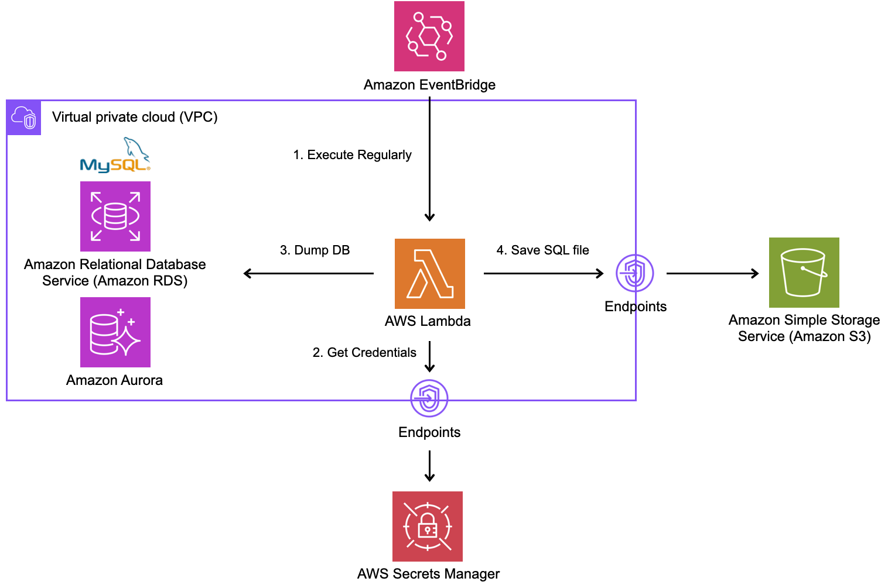

# cdk-rds-dump

cdk-rds-dump is a Constructs library for AWS CDK that provides the functionality to dump the contents of Amazon RDS, generate it as an SQL file, and store it in Amazon S3.



[](https://constructs.dev/packages/cdk-rds-dump)
[](https://open.vscode.dev/badmintoncryer/cdk-rds-dump)
[](https://badge.fury.io/js/cdk-rds-dump)
[](https://github.com/badmintoncryer/cdk-rds-dump/actions/workflows/build.yml)
[](https://github.com/badmintoncryer/cdk-rds-dump/actions/workflows/release.yml)
[](https://opensource.org/licenses/Apache-2.0)
[](https://www.npmjs.com/package/cdk-rds-dump)


## Usage

Install from npm:

```sh
npm i cdk-rds-dump
```

Then write CDK code as below:

```ts
import { RdsDump } from 'cdk-rds-dump';

declare const rdsCluster: rds.DatabaseCluster;
new RdsDump(this, 'MyRdsDump', {
  dbEngine: "mysql",
  rdsCluster: rdsCluster,
  schedule: events.Schedule.cron({ minute: "0", hour: "0" }),
  databaseName: 'myDatabase',
  createSecretsManagerVPCEndpoint: false,
});
```

## How does it work?

This code creates a new RDS cluster and uses the RdsDump Construct to dump the data from that RDS cluster. The dumped data is generated as an SQL file and stored in Amazon S3.

For detailed usage and details of the parameters, refer to the API documentation.

## Why do we need this construct?

AWS RDS is a very useful managed RDB service and includes, by default, the ability to create snapshots.
However, in some cases, such as for development reasons, it is easier to handle SQL files dumped from the DB.
Therefore, cdk-rds-dump was created as a construct to easily create SQL files on a regular basis.

## Contribution

Contributions to the project are welcome. Submit improvement proposals via pull requests or propose new features.

## License

This project is licensed under the Apache-2.0 License.

# API Reference <a name="API Reference" id="api-reference"></a>

## Constructs <a name="Constructs" id="Constructs"></a>

### RdsDump <a name="RdsDump" id="cdk-rds-dump.RdsDump"></a>

#### Initializers <a name="Initializers" id="cdk-rds-dump.RdsDump.Initializer"></a>

```typescript
import { RdsDump } from 'cdk-rds-dump'

new RdsDump(scope: Construct, id: string, __2: RdsDumpProps)
```

| **Name** | **Type** | **Description** |
| --- | --- | --- |
| <code><a href="#cdk-rds-dump.RdsDump.Initializer.parameter.scope">scope</a></code> | <code>constructs.Construct</code> | *No description.* |
| <code><a href="#cdk-rds-dump.RdsDump.Initializer.parameter.id">id</a></code> | <code>string</code> | *No description.* |
| <code><a href="#cdk-rds-dump.RdsDump.Initializer.parameter.__2">__2</a></code> | <code><a href="#cdk-rds-dump.RdsDumpProps">RdsDumpProps</a></code> | *No description.* |

---

##### `scope`<sup>Required</sup> <a name="scope" id="cdk-rds-dump.RdsDump.Initializer.parameter.scope"></a>

- *Type:* constructs.Construct

---

##### `id`<sup>Required</sup> <a name="id" id="cdk-rds-dump.RdsDump.Initializer.parameter.id"></a>

- *Type:* string

---

##### `__2`<sup>Required</sup> <a name="__2" id="cdk-rds-dump.RdsDump.Initializer.parameter.__2"></a>

- *Type:* <a href="#cdk-rds-dump.RdsDumpProps">RdsDumpProps</a>

---

#### Methods <a name="Methods" id="Methods"></a>

| **Name** | **Description** |
| --- | --- |
| <code><a href="#cdk-rds-dump.RdsDump.toString">toString</a></code> | Returns a string representation of this construct. |

---

##### `toString` <a name="toString" id="cdk-rds-dump.RdsDump.toString"></a>

```typescript
public toString(): string
```

Returns a string representation of this construct.

#### Static Functions <a name="Static Functions" id="Static Functions"></a>

| **Name** | **Description** |
| --- | --- |
| <code><a href="#cdk-rds-dump.RdsDump.isConstruct">isConstruct</a></code> | Checks if `x` is a construct. |

---

##### ~~`isConstruct`~~ <a name="isConstruct" id="cdk-rds-dump.RdsDump.isConstruct"></a>

```typescript
import { RdsDump } from 'cdk-rds-dump'

RdsDump.isConstruct(x: any)
```

Checks if `x` is a construct.

###### `x`<sup>Required</sup> <a name="x" id="cdk-rds-dump.RdsDump.isConstruct.parameter.x"></a>

- *Type:* any

Any object.

---

#### Properties <a name="Properties" id="Properties"></a>

| **Name** | **Type** | **Description** |
| --- | --- | --- |
| <code><a href="#cdk-rds-dump.RdsDump.property.node">node</a></code> | <code>constructs.Node</code> | The tree node. |

---

##### `node`<sup>Required</sup> <a name="node" id="cdk-rds-dump.RdsDump.property.node"></a>

```typescript
public readonly node: Node;
```

- *Type:* constructs.Node

The tree node.

---


## Structs <a name="Structs" id="Structs"></a>

### RdsDumpProps <a name="RdsDumpProps" id="cdk-rds-dump.RdsDumpProps"></a>

#### Initializer <a name="Initializer" id="cdk-rds-dump.RdsDumpProps.Initializer"></a>

```typescript
import { RdsDumpProps } from 'cdk-rds-dump'

const rdsDumpProps: RdsDumpProps = { ... }
```

#### Properties <a name="Properties" id="Properties"></a>

| **Name** | **Type** | **Description** |
| --- | --- | --- |
| <code><a href="#cdk-rds-dump.RdsDumpProps.property.createSecretsManagerVPCEndpoint">createSecretsManagerVPCEndpoint</a></code> | <code>boolean</code> | It is recommended to use a secret stored in the Secrets Manager, but in that case, the lambda doing the dump needs a route to access the Secrets Manager. |
| <code><a href="#cdk-rds-dump.RdsDumpProps.property.databaseName">databaseName</a></code> | <code>string</code> | Database name to dump. |
| <code><a href="#cdk-rds-dump.RdsDumpProps.property.dbEngine">dbEngine</a></code> | <code>string</code> | Select DB engine type. |
| <code><a href="#cdk-rds-dump.RdsDumpProps.property.rdsCluster">rdsCluster</a></code> | <code>aws-cdk-lib.aws_rds.DatabaseCluster</code> | RDS Cluster to dump. |
| <code><a href="#cdk-rds-dump.RdsDumpProps.property.schedule">schedule</a></code> | <code>aws-cdk-lib.aws_events.Schedule</code> | Schedule to dump. |
| <code><a href="#cdk-rds-dump.RdsDumpProps.property.idSuffix">idSuffix</a></code> | <code>string</code> | Suffix to add to the resource ID. |
| <code><a href="#cdk-rds-dump.RdsDumpProps.property.lambdaEnv">lambdaEnv</a></code> | <code>{[ key: string ]: string}</code> | Environment variables to set in the lambda function. |
| <code><a href="#cdk-rds-dump.RdsDumpProps.property.lambdaNsg">lambdaNsg</a></code> | <code>aws-cdk-lib.aws_ec2.ISecurityGroup[]</code> | Security group to allow access to the lambda function. |
| <code><a href="#cdk-rds-dump.RdsDumpProps.property.secretId">secretId</a></code> | <code>string</code> | Database connection information stored in the Secrets Manager. |
| <code><a href="#cdk-rds-dump.RdsDumpProps.property.secretsManagerVPCEndpointNsgId">secretsManagerVPCEndpointNsgId</a></code> | <code>string</code> | List of IDs of security groups to attach to the Interface Endpoint for Secrets Manager. |
| <code><a href="#cdk-rds-dump.RdsDumpProps.property.unsecurePassword">unsecurePassword</a></code> | <code>string</code> | Database Password. |
| <code><a href="#cdk-rds-dump.RdsDumpProps.property.unsecureUserName">unsecureUserName</a></code> | <code>string</code> | Database username. |

---

##### `createSecretsManagerVPCEndpoint`<sup>Required</sup> <a name="createSecretsManagerVPCEndpoint" id="cdk-rds-dump.RdsDumpProps.property.createSecretsManagerVPCEndpoint"></a>

```typescript
public readonly createSecretsManagerVPCEndpoint: boolean;
```

- *Type:* boolean

It is recommended to use a secret stored in the Secrets Manager, but in that case, the lambda doing the dump needs a route to access the Secrets Manager.

If createSecretsManagerVPCEndpoint is true, an Interface Endpoint is created to allow access to the Secrets Manager.

---

##### `databaseName`<sup>Required</sup> <a name="databaseName" id="cdk-rds-dump.RdsDumpProps.property.databaseName"></a>

```typescript
public readonly databaseName: string;
```

- *Type:* string

Database name to dump.

---

##### `dbEngine`<sup>Required</sup> <a name="dbEngine" id="cdk-rds-dump.RdsDumpProps.property.dbEngine"></a>

```typescript
public readonly dbEngine: string;
```

- *Type:* string

Select DB engine type.

Currently only mysql can be selected.

---

##### `rdsCluster`<sup>Required</sup> <a name="rdsCluster" id="cdk-rds-dump.RdsDumpProps.property.rdsCluster"></a>

```typescript
public readonly rdsCluster: DatabaseCluster;
```

- *Type:* aws-cdk-lib.aws_rds.DatabaseCluster

RDS Cluster to dump.

---

##### `schedule`<sup>Required</sup> <a name="schedule" id="cdk-rds-dump.RdsDumpProps.property.schedule"></a>

```typescript
public readonly schedule: Schedule;
```

- *Type:* aws-cdk-lib.aws_events.Schedule

Schedule to dump.

See aws-cdk-lib/aws-events.Schedule.
ex.
import * as events from 'aws-cdk-lib/aws-events'
// It is executed daily at 00:00 UTC.
events.Schedule.cron({ minute: "0", hour: "0" })

---

##### `idSuffix`<sup>Optional</sup> <a name="idSuffix" id="cdk-rds-dump.RdsDumpProps.property.idSuffix"></a>

```typescript
public readonly idSuffix: string;
```

- *Type:* string

Suffix to add to the resource ID.

---

##### `lambdaEnv`<sup>Optional</sup> <a name="lambdaEnv" id="cdk-rds-dump.RdsDumpProps.property.lambdaEnv"></a>

```typescript
public readonly lambdaEnv: {[ key: string ]: string};
```

- *Type:* {[ key: string ]: string}

Environment variables to set in the lambda function.

ex. { "ENV_VAR": "value" }

---

##### `lambdaNsg`<sup>Optional</sup> <a name="lambdaNsg" id="cdk-rds-dump.RdsDumpProps.property.lambdaNsg"></a>

```typescript
public readonly lambdaNsg: ISecurityGroup[];
```

- *Type:* aws-cdk-lib.aws_ec2.ISecurityGroup[]

Security group to allow access to the lambda function.

---

##### `secretId`<sup>Optional</sup> <a name="secretId" id="cdk-rds-dump.RdsDumpProps.property.secretId"></a>

```typescript
public readonly secretId: string;
```

- *Type:* string

Database connection information stored in the Secrets Manager.

We recommend using the secret stored in the Secrets Manager as the connection information to the DB,
but it is also possible to specify the user name and password directly.
If secretId is set, the corresponding secret on SecretsManager is retrieved to access the DB.

---

##### `secretsManagerVPCEndpointNsgId`<sup>Optional</sup> <a name="secretsManagerVPCEndpointNsgId" id="cdk-rds-dump.RdsDumpProps.property.secretsManagerVPCEndpointNsgId"></a>

```typescript
public readonly secretsManagerVPCEndpointNsgId: string;
```

- *Type:* string

List of IDs of security groups to attach to the Interface Endpoint for Secrets Manager.

Only used if createSecretsManagerVPCEndpoint is true.

---

##### `unsecurePassword`<sup>Optional</sup> <a name="unsecurePassword" id="cdk-rds-dump.RdsDumpProps.property.unsecurePassword"></a>

```typescript
public readonly unsecurePassword: string;
```

- *Type:* string

Database Password.

We recommend using the secret stored in the Secrets Manager as the connection information to the DB,
but it is also possible to specify the user name and password directly.
unsecurePassword is a parameter to pass the password when the latter is used.

---

##### `unsecureUserName`<sup>Optional</sup> <a name="unsecureUserName" id="cdk-rds-dump.RdsDumpProps.property.unsecureUserName"></a>

```typescript
public readonly unsecureUserName: string;
```

- *Type:* string

Database username.

We recommend using the secret stored in the Secrets Manager as the connection information to the DB,
but it is also possible to specify the user name and password directly.
unsecureUserName is a parameter to pass the user name when the latter is used.

---


